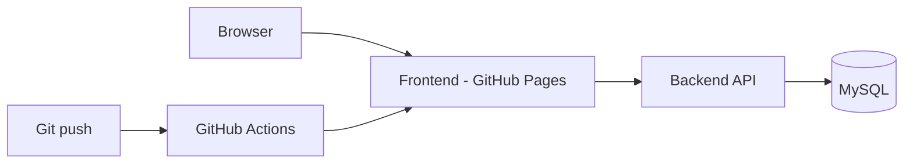

# GoToKart documentation

Welcome to the official docs for [GoToKart](https://github.com/gotokart), covering product architecture, APIs, deployment, and project activity in one place.

  <h2>Build, Ship, and Track GoToKart</h2>
  
Everything you need for API understanding, deployment flow, and docs activity in one place.

  

    <a className="gk-cta" href="https://gotokart.github.io/frontend/#" target="_blank" rel="noreferrer">
      Live
      Open Storefront
    </a>
    <a className="gk-cta" href="backend/" rel="noreferrer">
      API
      Backend Guide
    </a>
    <a className="gk-cta" href="activity/" rel="noreferrer">
      Timeline
      Commit Activity
    </a>
  

## Repositories

  

    <strong>backend</strong>
    
Spring Boot REST API for users, products, cart, and orders.

    <a href="https://github.com/gotokart/backend" target="_blank" rel="noreferrer">Open repository →</a>
  

  

    <strong>frontend</strong>
    
Vanilla HTML/CSS/JS storefront deployed on GitHub Pages.

    <a href="https://github.com/gotokart/frontend" target="_blank" rel="noreferrer">Open repository →</a>
  

  

    <strong>infra</strong>
    
Infra notes, deployment mapping, and environment reference.

    <a href="https://github.com/gotokart/infra" target="_blank" rel="noreferrer">Open repository →</a>
  

  

    <strong>.github</strong>
    
Shared CI/CD workflows used to build and deploy services/docs.

    <a href="https://github.com/gotokart/.github" target="_blank" rel="noreferrer">Open repository →</a>
  

## High-level architecture

## Where to go next

- **Getting started** — clone repos and run locally
- **Backend API** — clickable endpoint guide with examples and usage notes
- **Frontend** — structure and API usage
- **Infrastructure** — domains and deployment flow
- **Commit activity** — timeline + full list of docs commits (generated from git)
