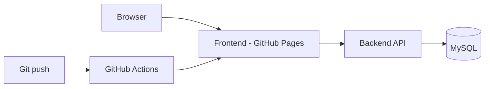

# GoToKart documentation

Welcome. This site documents the [GoToKart](https://github.com/gotokart) platform: a Spring Boot API, a vanilla web storefront, and deployment notes.

## Repositories

| Repository | Role |
|------------|------|
| [backend](https://github.com/gotokart/backend) | Spring Boot REST API (users, products, cart, orders) |
| [frontend](https://github.com/gotokart/frontend) | HTML / CSS / JavaScript storefront |
| [infra](https://github.com/gotokart/infra) | Architecture and hosting notes |
| [.github](https://github.com/gotokart/.github) | Shared CI/CD workflows |
| [docs](https://github.com/gotokart/docs) | This documentation site |

## High-level architecture

## Where to go next

- **Getting started** — clone repos and run locally
- **Backend API** — endpoints and configuration
- **Frontend** — structure and API usage
- **Infrastructure** — domains and deployment flow
- **Commit activity** — timeline of changes to this docs repo (generated from git)
