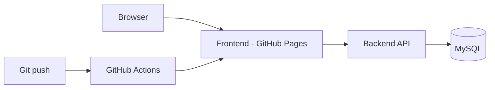

# GoToKart documentation

Welcome to the official docs for [GoToKart](https://github.com/gotokart), covering product architecture, APIs, deployment, and project activity in one place.

## Quick access

> **Live storefront:** [https://gotokart.github.io/frontend/#](https://gotokart.github.io/frontend/#)
>
> **Docs repository:** [https://github.com/gotokart/docs](https://github.com/gotokart/docs)
>
> **Organization:** [https://github.com/gotokart](https://github.com/gotokart)

## Repositories

| Repository | Role |
|------------|------|
| [backend](https://github.com/gotokart/backend) | Spring Boot REST API (users, products, cart, orders) |
| [frontend](https://github.com/gotokart/frontend) | HTML / CSS / JavaScript storefront |
| [infra](https://github.com/gotokart/infra) | Architecture and hosting notes |
| [.github](https://github.com/gotokart/.github) | Shared CI/CD workflows |
| [docs](https://github.com/gotokart/docs) | This documentation site |

## High-level architecture

## Where to go next

- **Getting started** — clone repos and run locally
- **Backend API** — clickable endpoint guide with examples and usage notes
- **Frontend** — structure and API usage
- **Infrastructure** — domains and deployment flow
- **Commit activity** — timeline + full list of docs commits (generated from git)
