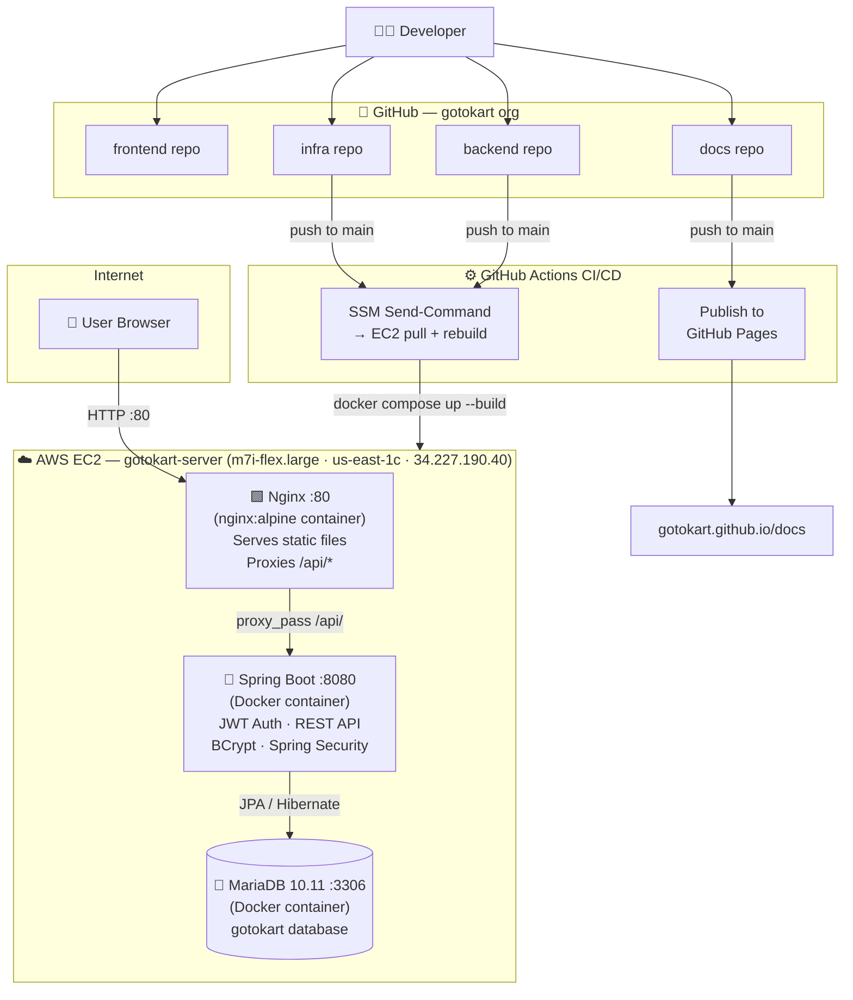

# GoToKart documentation

Welcome to the official docs for [GoToKart](https://github.com/gotokart), covering product architecture, APIs, deployment, and project activity in one place.

<div className="gk-hero">
  <span className="gk-hero-eyebrow">Official platform docs</span>
  <h2>Build, Ship, and Track GoToKart</h2>
  <p>Everything you need for API understanding, deployment flow, and docs activity in one place.</p>
  <div className="gk-stat-row">
    <span className="gk-stat">Spring Boot Backend</span>
    <span className="gk-stat">JWT Authentication</span>
    <span className="gk-stat">Vanilla JS Frontend</span>
    <span className="gk-stat">AWS EC2 Deployed</span>
    <span className="gk-stat">MariaDB + Docker</span>
    <span className="gk-stat">102 Products Seeded</span>
  </div>
  <div className="gk-cta-grid">
    <a className="gk-cta" href="http://34.227.190.40" target="_blank" rel="noreferrer">
      <span className="gk-kicker">Live</span>
      <span className="gk-title">GoToKart Live Store</span>
    </a>
    <a className="gk-cta" href="backend/" rel="noreferrer">
      <span className="gk-kicker">API</span>
      <span className="gk-title">Backend Guide</span>
    </a>
    <a className="gk-cta" href="activity/" rel="noreferrer">
      <span className="gk-kicker">Timeline</span>
      <span className="gk-title">Commit Activity</span>
    </a>
  </div>
</div>

## Repositories in organization

<div className="gk-repo-grid">
  <div className="gk-repo-card">
    <strong>backend</strong>
    <p>Spring Boot REST API for users, products, cart, and orders.</p>
    <a href="https://github.com/gotokart/backend" target="_blank" rel="noreferrer">Open repository →</a>
  </div>
  <div className="gk-repo-card">
    <strong>frontend</strong>
    <p>Vanilla HTML/CSS/JS storefront deployed on GitHub Pages.</p>
    <a href="https://github.com/gotokart/frontend" target="_blank" rel="noreferrer">Open repository →</a>
  </div>
  <div className="gk-repo-card">
    <strong>infra</strong>
    <p>Infra notes, deployment mapping, and environment reference.</p>
    <a href="https://github.com/gotokart/infra" target="_blank" rel="noreferrer">Open repository →</a>
  </div>
  <div className="gk-repo-card">
    <strong>.github</strong>
    <p>Shared CI/CD workflows used to build and deploy services/docs.</p>
    <a href="https://github.com/gotokart/.github" target="_blank" rel="noreferrer">Open repository →</a>
  </div>
  <div className="gk-repo-card">
    <strong>docs</strong>
    <p>Project documentation site with architecture, API guides, and activity timeline.</p>
    <a href="https://github.com/gotokart/docs" target="_blank" rel="noreferrer">Open repository →</a>
  </div>
</div>

## High-level architecture

<p className="gk-arch-note">
  Runtime architecture + CI/CD delivery flow:
</p>



### Request flow

```
Browser  ──HTTP──▶  EC2 :80 (Nginx)
                        │
                   /api/* ──proxy_pass──▶  backend:8080 (Spring Boot)
                        │                       │
                   /    ──static files           └──JPA──▶  mariadb:3306
```

## Where to go next

<div className="gk-next-grid">
  <a className="gk-next-card" href="getting-started/">
    <strong>Getting started</strong>
    <span>Clone repos and run everything locally.</span>
  </a>
  <a className="gk-next-card" href="backend/">
    <strong>Backend API</strong>
    <span>Endpoint reference with examples and usage tips.</span>
  </a>
  <a className="gk-next-card" href="frontend/">
    <strong>Frontend</strong>
    <span>UI structure, integration points, and behavior notes.</span>
  </a>
  <a className="gk-next-card" href="infrastructure/">
    <strong>Infrastructure</strong>
    <span>Domains, CI/CD, deployment map, and runtime flow.</span>
  </a>
  <a className="gk-next-card" href="activity/">
    <strong>Commit activity</strong>
    <span>Timeline and full commit list generated from git history.</span>
  </a>
</div>
