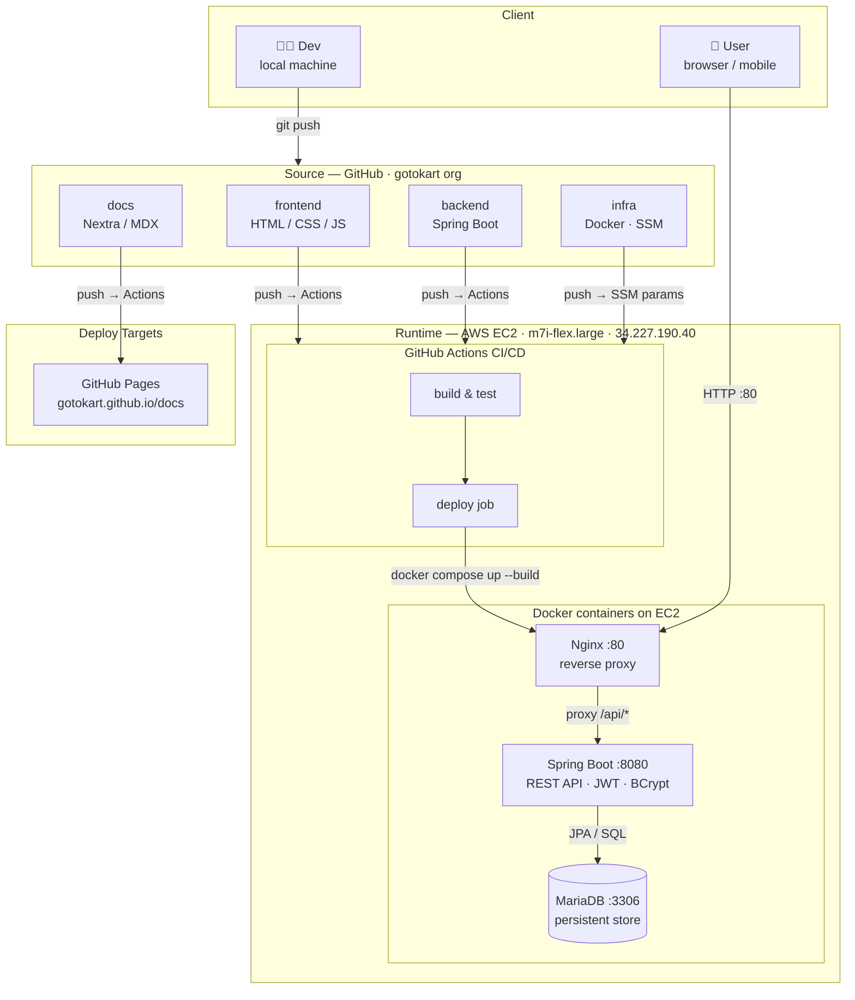

# Infrastructure

Full deployment reference for GoToKart on AWS EC2. See the [infra repo](https://github.com/gotokart/infra) for all config files.

## Live deployment

| | |
|-|-|
| **URL** | `http://34.227.190.40` |
| **Instance** | `gotokart-server` — `m7i-flex.large` — `us-east-1c` |
| **OS** | Amazon Linux 2023 (kernel 6.1) |
| **Launched** | 2026-04-07 |

## Architecture



All three services run as Docker containers on a single EC2 instance, connected via internal bridge network (`gotokart-net`). Only Nginx is exposed to the internet on port 80.

---

## Docker services

| Container | Image | Exposed | Notes |
|-----------|-------|---------|-------|
| `gotokart-mysql` | `mariadb:10.11` | Internal only | MySQL-compatible; avoids ioctl bug on AL2023 |
| `gotokart-backend` | Built from `Dockerfile` | Internal :8080 | Spring Boot, 350 MB mem limit |
| `gotokart-nginx` | `nginx:alpine` | Port 80 → public | Serves frontend + proxies `/api/` |

> **Why MariaDB?** The official `mysql:8.x` Docker image crashes on Amazon Linux 2023's kernel (`Inappropriate ioctl for device`). MariaDB 10.11 is a drop-in MySQL replacement with no such issue.

---

## EC2 — one-time setup

### 1. Install Docker & plugins

```bash
sudo yum install -y docker git
sudo systemctl start docker && sudo systemctl enable docker
sudo usermod -aG docker ec2-user

# Install latest buildx + compose plugins
sudo mkdir -p /usr/local/lib/docker/cli-plugins
sudo curl -SL "https://github.com/docker/buildx/releases/download/v0.19.3/buildx-v0.19.3.linux-amd64" \
  -o /usr/local/lib/docker/cli-plugins/docker-buildx && \
  sudo chmod +x /usr/local/lib/docker/cli-plugins/docker-buildx
sudo curl -SL "https://github.com/docker/compose/releases/download/v2.33.1/docker-compose-linux-x86_64" \
  -o /usr/local/lib/docker/cli-plugins/docker-compose && \
  sudo chmod +x /usr/local/lib/docker/cli-plugins/docker-compose
exit  # re-login for docker group
```

### 2. Add swap (prevents OOM on small instances)

```bash
sudo fallocate -l 2G /swapfile && sudo chmod 600 /swapfile
sudo mkswap /swapfile && sudo swapon /swapfile
echo '/swapfile swap swap defaults 0 0' | sudo tee -a /etc/fstab
```

### 3. Clone repos & first deploy

```bash
mkdir -p /home/ec2-user/gotokart && cd /home/ec2-user/gotokart
git clone https://github.com/gotokart/backend.git
git clone https://github.com/gotokart/frontend.git
git clone https://github.com/gotokart/infra.git

# Copy backend source into infra (Docker build context)
cp backend/pom.xml infra/
cp -r backend/src infra/src
cp -r frontend/. infra/frontend/

cd infra && docker compose up -d --build
```

On first startup, the backend automatically seeds **102 products** and creates the admin user.

---

## Re-deploy after code changes

SSH in and run this single command:

```bash
cd /home/ec2-user/gotokart && \
  git -C backend pull origin main && \
  git -C frontend pull origin main && \
  git -C infra pull origin main && \
  cp backend/pom.xml infra/ && \
  cp -r backend/src infra/src && \
  cp -r frontend/. infra/frontend/ && \
  cd infra && docker compose up -d --build
```

---

## Nginx routing

| Path | Destination |
|------|-------------|
| `/` | Static files (`infra/frontend/`) |
| `/api/*` | `http://backend:8080/api/` |

---

## Useful commands

```bash
docker compose ps                      # check all containers
docker logs -f gotokart-backend        # backend logs live
docker logs -f gotokart-mysql          # MariaDB logs
docker compose restart nginx           # reload nginx config
docker compose down -v && docker compose up -d --build  # full wipe + rebuild
```

---

## EC2 Security Group

| Type | Port | Source |
|------|------|--------|
| SSH | 22 | Your IP |
| HTTP | 80 | 0.0.0.0/0 |

---

## CI/CD flow

The `infra/.github/workflows/deploy.yml` workflow triggers on push to `infra/main`:
1. Authenticates to AWS via OIDC (no stored keys)
2. Sends `aws ssm send-command` to EC2
3. EC2 pulls all repos, copies source, rebuilds containers

Manual trigger also available from the GitHub Actions UI (`workflow_dispatch`).

Required GitHub secrets: `AWS_IAM_ROLE_ARN`, `AWS_REGION`, `EC2_INSTANCE_ID`.
